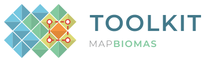
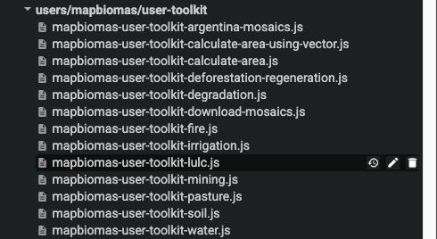
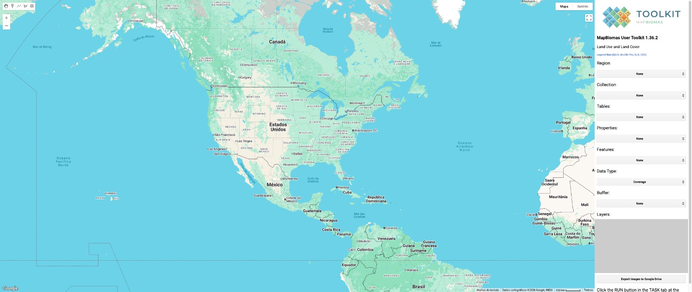
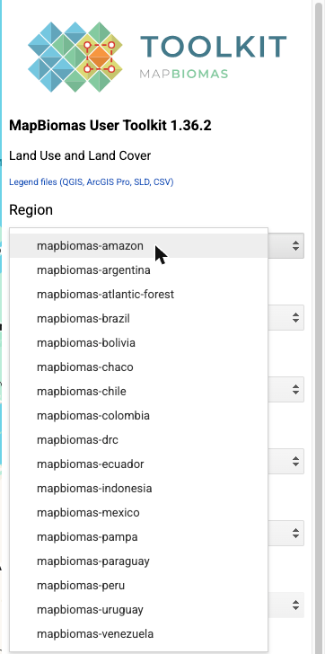
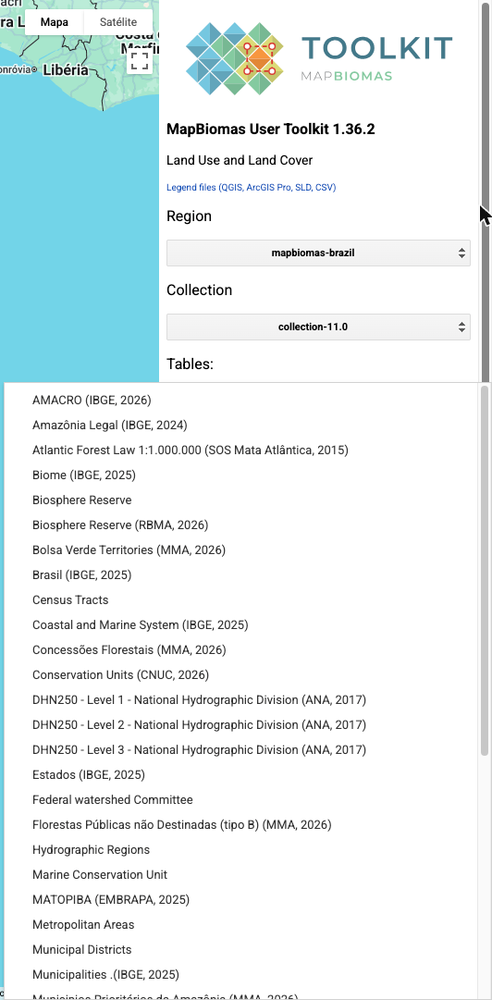
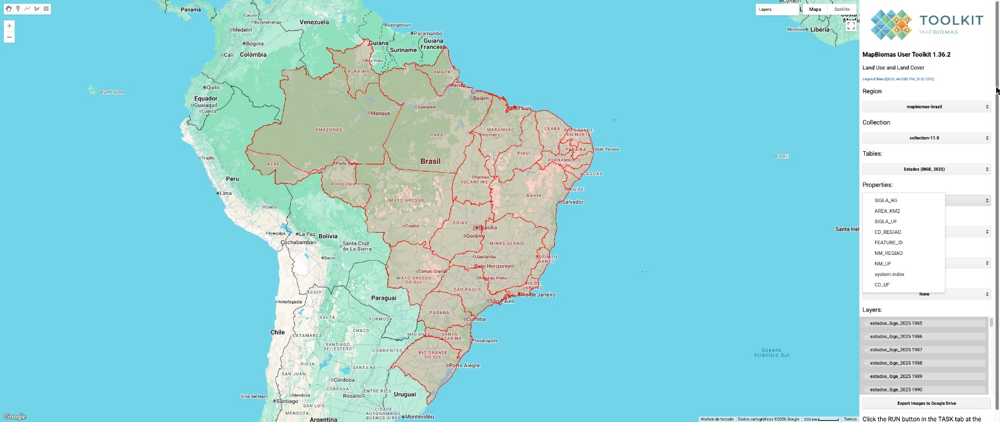
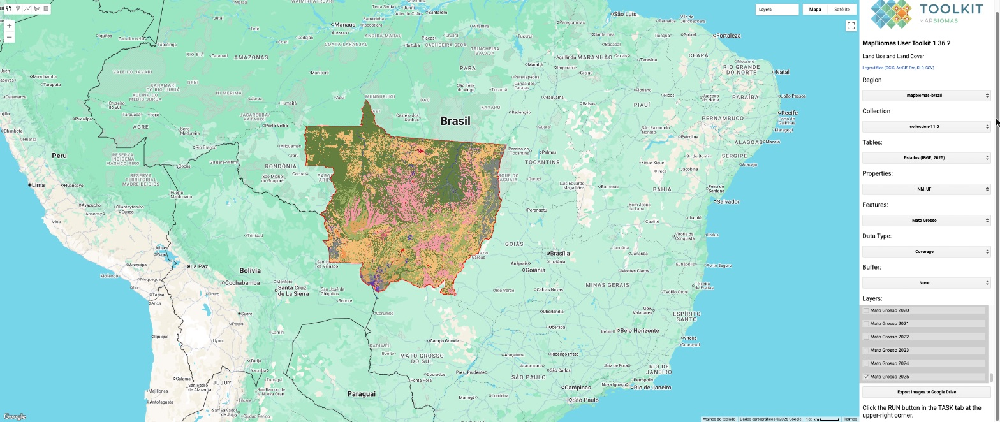
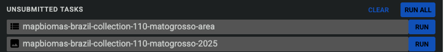
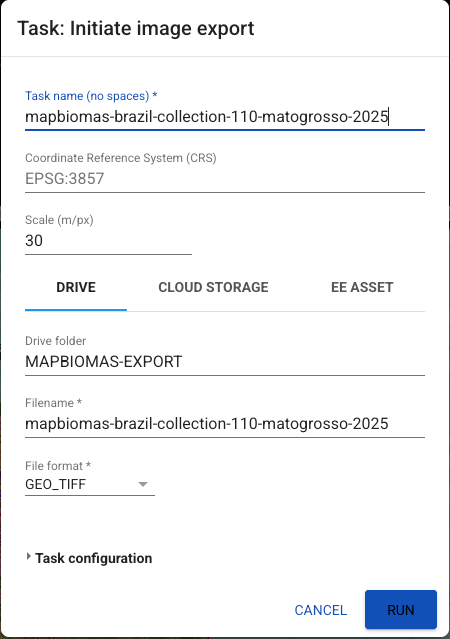
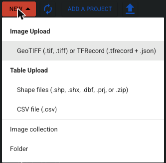

  <picture>
    <source media="(prefers-color-scheme: dark)" srcset="misc/toolkit-lockup-dark.svg">
    
  </picture>

# MapBiomas User Toolkit

Open-source Google Earth Engine apps to **view, clip and download MapBiomas data** for any territory, with no programming required.

## About

[MapBiomas](https://mapbiomas.org) is a collaborative network of NGOs, universities and technology companies that produces annual maps of land use and land cover, and related themes, from 1985 to the present. The maps are made from Landsat imagery at 30 m resolution and cover Brazil, the Pan-Amazon, the Chaco, the trinational Atlantic Forest and Pampa, many other countries in South America, and Mexico, Indonesia and the Democratic Republic of the Congo. All data are public and free under a [CC BY 4.0](https://creativecommons.org/licenses/by/4.0/) license.

The **User Toolkit** is a set of Google Earth Engine (GEE) Code Editor apps that sit on top of these public collections. With them you can:

- **pick a region and a collection**, including the latest release and earlier ones;
- **choose a territory**, either one of the official layers (countries, states, municipalities, basins, biomes, protected areas, indigenous territories and more) or **your own vector** uploaded to GEE;
- **view the maps year by year** in the MapBiomas legend colors;
- **export the rasters as GeoTIFF to your Google Drive**, clipped to the territory, with an optional buffer;
- **export a CSV with the area of each class per year** for that territory.

## Toolkits

| Toolkit | What it gives you | Coverage | Open in GEE |
|---|---|---|---|
| **Land use and land cover** | Annual coverage, transitions and quality | 17 regions (below) | [lulc](https://code.earthengine.google.com/?scriptPath=users/mapbiomas/user-toolkit:mapbiomas-user-toolkit-lulc.js) |
| **Deforestation and secondary vegetation** | Vegetation suppression, regrowth and secondary vegetation age | Brazil C11, Peru C4, Bolivia/Uruguay/Paraguay C3, Colombia C2, Argentina C2 | [deforestation-regeneration](https://code.earthengine.google.com/?scriptPath=users/mapbiomas/user-toolkit:mapbiomas-user-toolkit-deforestation-regeneration.js) |
| **Fire** | Annual and monthly burned area, frequency, accumulated area, year of last fire, severity, scar size | Brazil C5 and monthly monitor, Indonesia, Paraguay, Peru | [fire](https://code.earthengine.google.com/?scriptPath=users/mapbiomas/user-toolkit:mapbiomas-user-toolkit-fire.js) |
| **Water** | Annual water surface and frequency | Brazil C5, Pan-Amazon countries | [water](https://code.earthengine.google.com/?scriptPath=users/mapbiomas/user-toolkit:mapbiomas-user-toolkit-water.js) |
| **Irrigation** | Irrigation systems | Brazil C11 | [irrigation](https://code.earthengine.google.com/?scriptPath=users/mapbiomas/user-toolkit:mapbiomas-user-toolkit-irrigation.js) |
| **Mining** | Mined substances (industrial and artisanal mining) | Brazil C11 | [mining](https://code.earthengine.google.com/?scriptPath=users/mapbiomas/user-toolkit:mapbiomas-user-toolkit-mining.js) |
| **Pasture** | Pasture quality and vigor | Brazil C11 | [pasture](https://code.earthengine.google.com/?scriptPath=users/mapbiomas/user-toolkit:mapbiomas-user-toolkit-pasture.js) |
| **Soil** (beta) | Soil organic carbon, texture, granulometry, stoniness | Brazil | [soil](https://code.earthengine.google.com/?scriptPath=users/mapbiomas/user-toolkit:mapbiomas-user-toolkit-soil.js) |
| **Degradation** (beta) | Edge, patch size, isolation, fire and secondary vegetation age | Brazil | [degradation](https://code.earthengine.google.com/?scriptPath=users/mapbiomas/user-toolkit:mapbiomas-user-toolkit-degradation.js) |

There are also small helper scripts: `calculate-area`, `calculate-area-using-vector`, and three for downloading Landsat mosaics.

### Land use and land cover: latest collection per region

| Region | Latest collection | Years | Territory layers | Legend files |
|---|---|---|---|---|
| Amazon (Pan-Amazon) | 6.0 | 1985–2023 | 6 | [CSV](legend-colors/coverage/amazon-collection-6.0.csv) · [QML](legend-colors/coverage/amazon-collection-6.0.qml) · [LYRX](legend-colors/coverage/amazon-collection-6.0.lyrx) · [SLD](legend-colors/coverage/amazon-collection-6.0.sld) |
| Argentina | 3.0 | 1985–2025 | 10 | [CSV](legend-colors/coverage/argentina-collection-3.0.csv) · [QML](legend-colors/coverage/argentina-collection-3.0.qml) · [LYRX](legend-colors/coverage/argentina-collection-3.0.lyrx) · [SLD](legend-colors/coverage/argentina-collection-3.0.sld) |
| Atlantic Forest (trinational) | 4.0 | 1985–2023 | 8 | [CSV](legend-colors/coverage/atlantic-forest-collection-4.0.csv) · [QML](legend-colors/coverage/atlantic-forest-collection-4.0.qml) · [LYRX](legend-colors/coverage/atlantic-forest-collection-4.0.lyrx) · [SLD](legend-colors/coverage/atlantic-forest-collection-4.0.sld) |
| Bolivia | 3.0 | 1985–2024 | 11 | [CSV](legend-colors/coverage/bolivia-collection-3.0.csv) · [QML](legend-colors/coverage/bolivia-collection-3.0.qml) · [LYRX](legend-colors/coverage/bolivia-collection-3.0.lyrx) · [SLD](legend-colors/coverage/bolivia-collection-3.0.sld) |
| Brazil | 11.0 | 1985–2025 | 39 | [CSV](legend-colors/coverage/brazil-collection-11.0.csv) · [QML](legend-colors/coverage/brazil-collection-11.0.qml) · [LYRX](legend-colors/coverage/brazil-collection-11.0.lyrx) · [SLD](legend-colors/coverage/brazil-collection-11.0.sld) |
| Chaco | 5.0 | 1985–2023 | 6 | [CSV](legend-colors/coverage/chaco-collection-5.0.csv) · [QML](legend-colors/coverage/chaco-collection-5.0.qml) · [LYRX](legend-colors/coverage/chaco-collection-5.0.lyrx) · [SLD](legend-colors/coverage/chaco-collection-5.0.sld) |
| Chile | 2.0 | 1999–2024 | 9 | [CSV](legend-colors/coverage/chile-collection-2.0.csv) · [QML](legend-colors/coverage/chile-collection-2.0.qml) · [LYRX](legend-colors/coverage/chile-collection-2.0.lyrx) · [SLD](legend-colors/coverage/chile-collection-2.0.sld) |
| Colombia | 3.0 | 1985–2024 | 6 | [CSV](legend-colors/coverage/colombia-collection-3.0.csv) · [QML](legend-colors/coverage/colombia-collection-3.0.qml) · [LYRX](legend-colors/coverage/colombia-collection-3.0.lyrx) · [SLD](legend-colors/coverage/colombia-collection-3.0.sld) |
| DR Congo | 1.0 | 2000–2025 | 5 | [CSV](legend-colors/coverage/drc-collection-1.0.csv) · [QML](legend-colors/coverage/drc-collection-1.0.qml) · [LYRX](legend-colors/coverage/drc-collection-1.0.lyrx) · [SLD](legend-colors/coverage/drc-collection-1.0.sld) |
| Ecuador | 3.0 | 1985–2024 | 26 | [CSV](legend-colors/coverage/ecuador-collection-3.0.csv) · [QML](legend-colors/coverage/ecuador-collection-3.0.qml) · [LYRX](legend-colors/coverage/ecuador-collection-3.0.lyrx) · [SLD](legend-colors/coverage/ecuador-collection-3.0.sld) |
| Indonesia | 4.1 | 1988–2024 | 24 | [CSV](legend-colors/coverage/indonesia-collection-4.1.csv) · [QML](legend-colors/coverage/indonesia-collection-4.1.qml) · [LYRX](legend-colors/coverage/indonesia-collection-4.1.lyrx) · [SLD](legend-colors/coverage/indonesia-collection-4.1.sld) |
| Mexico | 1.0 | 1985–2025 | 13 | [CSV](legend-colors/coverage/mexico-collection-1.0.csv) · [QML](legend-colors/coverage/mexico-collection-1.0.qml) · [LYRX](legend-colors/coverage/mexico-collection-1.0.lyrx) · [SLD](legend-colors/coverage/mexico-collection-1.0.sld) |
| Pampa (trinational) | 4.0 | 1985–2023 | 9 | [CSV](legend-colors/coverage/pampa-collection-4.0.csv) · [QML](legend-colors/coverage/pampa-collection-4.0.qml) · [LYRX](legend-colors/coverage/pampa-collection-4.0.lyrx) · [SLD](legend-colors/coverage/pampa-collection-4.0.sld) |
| Paraguay | 3.0 | 1985–2025 | 9 | [CSV](legend-colors/coverage/paraguay-collection-3.0.csv) · [QML](legend-colors/coverage/paraguay-collection-3.0.qml) · [LYRX](legend-colors/coverage/paraguay-collection-3.0.lyrx) · [SLD](legend-colors/coverage/paraguay-collection-3.0.sld) |
| Peru | 4.0 | 1985–2025 | 31 | [CSV](legend-colors/coverage/peru-collection-4.0.csv) · [QML](legend-colors/coverage/peru-collection-4.0.qml) · [LYRX](legend-colors/coverage/peru-collection-4.0.lyrx) · [SLD](legend-colors/coverage/peru-collection-4.0.sld) |
| Uruguay | 3.0 | 1985–2024 | 6 | [CSV](legend-colors/coverage/uruguay-collection-3.0.csv) · [QML](legend-colors/coverage/uruguay-collection-3.0.qml) · [LYRX](legend-colors/coverage/uruguay-collection-3.0.lyrx) · [SLD](legend-colors/coverage/uruguay-collection-3.0.sld) |
| Venezuela | 3.0 | 1985–2024 | 10 | [CSV](legend-colors/coverage/venezuela-collection-3.0.csv) · [QML](legend-colors/coverage/venezuela-collection-3.0.qml) · [LYRX](legend-colors/coverage/venezuela-collection-3.0.lyrx) · [SLD](legend-colors/coverage/venezuela-collection-3.0.sld) |

## Quick start

1. **Open the repository.** Follow [this link](https://code.earthengine.google.com/?accept_repo=users/mapbiomas/user-toolkit) to add the repository to your Code Editor. It shows up in the *Scripts* tab, under *Reader*. Open a toolkit, for example `mapbiomas-user-toolkit-lulc.js`, and click **Run**.

   

2. **Pick a region and a collection.** The toolkit panel opens on the right side of the map. Choose the **Region** first, then the **Collection**. The latest collection is at the top of the list.

   

   

3. **Choose a territory.** The **Tables** list has the official MapBiomas territories for the region (country, states, municipalities, biomes, basins, protected areas, indigenous lands and more), plus any tables you uploaded yourself (see step 7).

   

4. **Choose the property and the feature.** **Properties** is the attribute that names each feature (for states, `NM_UF`). Pick one, then choose the territory in **Features**. The map shows its outline.

   

5. **Choose the data type and the years.** **Data Type** offers coverage, and also transitions and quality when the collection has them. Tick the years you want under **Layers** and they are added to the map. **Buffer** (1 to 5 km) only changes the export area.

   

6. **Export.** Click **Export images to Google Drive**, open the **Tasks** tab and click **RUN** on each task. In the dialog, keep the defaults and click **RUN** again. You get one GeoTIFF per year and a CSV with the area of each class, in the `MAPBIOMAS-EXPORT` folder of your Google Drive.

   

   

7. **(Optional) Use your own territory.** In the *Assets* tab, use **NEW → Folder** to create a folder named `MAPBIOMAS` (all capitals) at the root of the Cloud project you use in the Code Editor. Then use **NEW → Shape files** to upload your `.shp`, `.shx`, `.dbf` and `.prj` files (or a `.zip`) into it. Every table in that folder appears in the **Tables** list, and you can pick the property and feature as in step 4.

   

A video tutorial (in Portuguese, recorded with an earlier version) is on [YouTube](https://www.youtube.com/watch?v=z3Yx1kwxWN0).

## Legend files

Legend files for the latest public collection of each dataset are in [`legend-colors/`](legend-colors). Each one comes in four formats:

- **CSV**: value, label, color (for spreadsheets, R, Python);
- **QML**: QGIS style (*Layer Properties → Symbology → Style → Load Style*);
- **LYRX**: ArcGIS Pro layer (*Apply Symbology From Layer*);
- **SLD**: Styled Layer Descriptor (GeoServer, QGIS, GEE `sldStyle`).

Coverage legends are listed with each region [above](#land-use-and-land-cover-latest-collection-per-region). The toolkits also link to these files from their panel. Fire labels (scar size, severity, return interval) follow the official MapBiomas Fire legend-code documents.

| Dataset | Legend files |
|---|---|
| Deforestation and secondary vegetation (all regions) | [CSV](legend-colors/deforestation/deforestation-secondary-vegetation.csv) · [QML](legend-colors/deforestation/deforestation-secondary-vegetation.qml) · [LYRX](legend-colors/deforestation/deforestation-secondary-vegetation.lyrx) · [SLD](legend-colors/deforestation/deforestation-secondary-vegetation.sld) |
| Brazil C11 — irrigation systems | [CSV](legend-colors/brazil-collection-11/irrigation-systems.csv) · [QML](legend-colors/brazil-collection-11/irrigation-systems.qml) · [LYRX](legend-colors/brazil-collection-11/irrigation-systems.lyrx) · [SLD](legend-colors/brazil-collection-11/irrigation-systems.sld) |
| Brazil C11 — pasture vigor | [CSV](legend-colors/brazil-collection-11/pasture-vigor.csv) · [QML](legend-colors/brazil-collection-11/pasture-vigor.qml) · [LYRX](legend-colors/brazil-collection-11/pasture-vigor.lyrx) · [SLD](legend-colors/brazil-collection-11/pasture-vigor.sld) |
| Brazil C11 — mining substances | [CSV](legend-colors/brazil-collection-11/mining-substances.csv) · [QML](legend-colors/brazil-collection-11/mining-substances.qml) · [LYRX](legend-colors/brazil-collection-11/mining-substances.lyrx) · [SLD](legend-colors/brazil-collection-11/mining-substances.sld) |
| Fire Brazil C5 — annual burned area | [CSV](legend-colors/fire/brazil-collection-5/annual-burned.csv) · [QML](legend-colors/fire/brazil-collection-5/annual-burned.qml) · [LYRX](legend-colors/fire/brazil-collection-5/annual-burned.lyrx) · [SLD](legend-colors/fire/brazil-collection-5/annual-burned.sld) |
| Fire Brazil C5 — burned coverage (land cover classes) | [CSV](legend-colors/fire/brazil-collection-5/burned-coverage.csv) · [QML](legend-colors/fire/brazil-collection-5/burned-coverage.qml) · [LYRX](legend-colors/fire/brazil-collection-5/burned-coverage.lyrx) · [SLD](legend-colors/fire/brazil-collection-5/burned-coverage.sld) |
| Fire Brazil C5 — accumulated burned area | [CSV](legend-colors/fire/brazil-collection-5/accumulated-burned.csv) · [QML](legend-colors/fire/brazil-collection-5/accumulated-burned.qml) · [LYRX](legend-colors/fire/brazil-collection-5/accumulated-burned.lyrx) · [SLD](legend-colors/fire/brazil-collection-5/accumulated-burned.sld) |
| Fire Brazil C5 — month of burn | [CSV](legend-colors/fire/brazil-collection-5/monthly-burned.csv) · [QML](legend-colors/fire/brazil-collection-5/monthly-burned.qml) · [LYRX](legend-colors/fire/brazil-collection-5/monthly-burned.lyrx) · [SLD](legend-colors/fire/brazil-collection-5/monthly-burned.sld) |
| Fire Brazil C5 — fire frequency | [CSV](legend-colors/fire/brazil-collection-5/fire-frequency.csv) · [QML](legend-colors/fire/brazil-collection-5/fire-frequency.qml) · [LYRX](legend-colors/fire/brazil-collection-5/fire-frequency.lyrx) · [SLD](legend-colors/fire/brazil-collection-5/fire-frequency.sld) |
| Fire Brazil C5 — year of last fire | [CSV](legend-colors/fire/brazil-collection-5/year-last-fire.csv) · [QML](legend-colors/fire/brazil-collection-5/year-last-fire.qml) · [LYRX](legend-colors/fire/brazil-collection-5/year-last-fire.lyrx) · [SLD](legend-colors/fire/brazil-collection-5/year-last-fire.sld) |
| Fire Brazil C5 — fire return interval | [CSV](legend-colors/fire/brazil-collection-5/interval-since-fire.csv) · [QML](legend-colors/fire/brazil-collection-5/interval-since-fire.qml) · [LYRX](legend-colors/fire/brazil-collection-5/interval-since-fire.lyrx) · [SLD](legend-colors/fire/brazil-collection-5/interval-since-fire.sld) |
| Fire Brazil C5 — burned area by scar size | [CSV](legend-colors/fire/brazil-collection-5/scar-size.csv) · [QML](legend-colors/fire/brazil-collection-5/scar-size.qml) · [LYRX](legend-colors/fire/brazil-collection-5/scar-size.lyrx) · [SLD](legend-colors/fire/brazil-collection-5/scar-size.sld) |
| Fire Brazil C5 — potential severity (beta) | [CSV](legend-colors/fire/brazil-collection-5/severity.csv) · [QML](legend-colors/fire/brazil-collection-5/severity.qml) · [LYRX](legend-colors/fire/brazil-collection-5/severity.lyrx) · [SLD](legend-colors/fire/brazil-collection-5/severity.sld) |
| Fire Indonesia C1 — annual burned area | [CSV](legend-colors/fire/indonesia-collection-1/annual-burned.csv) · [QML](legend-colors/fire/indonesia-collection-1/annual-burned.qml) · [LYRX](legend-colors/fire/indonesia-collection-1/annual-burned.lyrx) · [SLD](legend-colors/fire/indonesia-collection-1/annual-burned.sld) |
| Fire Indonesia C1 — accumulated burned area | [CSV](legend-colors/fire/indonesia-collection-1/accumulated-burned.csv) · [QML](legend-colors/fire/indonesia-collection-1/accumulated-burned.qml) · [LYRX](legend-colors/fire/indonesia-collection-1/accumulated-burned.lyrx) · [SLD](legend-colors/fire/indonesia-collection-1/accumulated-burned.sld) |
| Fire Indonesia C1 — month of burn | [CSV](legend-colors/fire/indonesia-collection-1/monthly-burned.csv) · [QML](legend-colors/fire/indonesia-collection-1/monthly-burned.qml) · [LYRX](legend-colors/fire/indonesia-collection-1/monthly-burned.lyrx) · [SLD](legend-colors/fire/indonesia-collection-1/monthly-burned.sld) |
| Fire Indonesia C1 — fire frequency | [CSV](legend-colors/fire/indonesia-collection-1/fire-frequency.csv) · [QML](legend-colors/fire/indonesia-collection-1/fire-frequency.qml) · [LYRX](legend-colors/fire/indonesia-collection-1/fire-frequency.lyrx) · [SLD](legend-colors/fire/indonesia-collection-1/fire-frequency.sld) |
| Fire Paraguay C1 — annual burned area | [CSV](legend-colors/fire/paraguay-collection-1/annual-burned.csv) · [QML](legend-colors/fire/paraguay-collection-1/annual-burned.qml) · [LYRX](legend-colors/fire/paraguay-collection-1/annual-burned.lyrx) · [SLD](legend-colors/fire/paraguay-collection-1/annual-burned.sld) |
| Fire Paraguay C1 — accumulated burned area | [CSV](legend-colors/fire/paraguay-collection-1/accumulated-burned.csv) · [QML](legend-colors/fire/paraguay-collection-1/accumulated-burned.qml) · [LYRX](legend-colors/fire/paraguay-collection-1/accumulated-burned.lyrx) · [SLD](legend-colors/fire/paraguay-collection-1/accumulated-burned.sld) |
| Fire Paraguay C1 — month of burn | [CSV](legend-colors/fire/paraguay-collection-1/monthly-burned.csv) · [QML](legend-colors/fire/paraguay-collection-1/monthly-burned.qml) · [LYRX](legend-colors/fire/paraguay-collection-1/monthly-burned.lyrx) · [SLD](legend-colors/fire/paraguay-collection-1/monthly-burned.sld) |
| Fire Paraguay C1 — fire frequency | [CSV](legend-colors/fire/paraguay-collection-1/fire-frequency.csv) · [QML](legend-colors/fire/paraguay-collection-1/fire-frequency.qml) · [LYRX](legend-colors/fire/paraguay-collection-1/fire-frequency.lyrx) · [SLD](legend-colors/fire/paraguay-collection-1/fire-frequency.sld) |
| Fire Peru C1 — annual burned area | [CSV](legend-colors/fire/peru-collection-1/annual-burned.csv) · [QML](legend-colors/fire/peru-collection-1/annual-burned.qml) · [LYRX](legend-colors/fire/peru-collection-1/annual-burned.lyrx) · [SLD](legend-colors/fire/peru-collection-1/annual-burned.sld) |
| Fire Peru C1 — accumulated burned area | [CSV](legend-colors/fire/peru-collection-1/accumulated-burned.csv) · [QML](legend-colors/fire/peru-collection-1/accumulated-burned.qml) · [LYRX](legend-colors/fire/peru-collection-1/accumulated-burned.lyrx) · [SLD](legend-colors/fire/peru-collection-1/accumulated-burned.sld) |
| Fire Peru C1 — month of burn | [CSV](legend-colors/fire/peru-collection-1/monthly-burned.csv) · [QML](legend-colors/fire/peru-collection-1/monthly-burned.qml) · [LYRX](legend-colors/fire/peru-collection-1/monthly-burned.lyrx) · [SLD](legend-colors/fire/peru-collection-1/monthly-burned.sld) |
| Fire Peru C1 — fire frequency | [CSV](legend-colors/fire/peru-collection-1/fire-frequency.csv) · [QML](legend-colors/fire/peru-collection-1/fire-frequency.qml) · [LYRX](legend-colors/fire/peru-collection-1/fire-frequency.lyrx) · [SLD](legend-colors/fire/peru-collection-1/fire-frequency.sld) |
| Fire Peru C1 — year of last fire | [CSV](legend-colors/fire/peru-collection-1/year-last-fire.csv) · [QML](legend-colors/fire/peru-collection-1/year-last-fire.qml) · [LYRX](legend-colors/fire/peru-collection-1/year-last-fire.lyrx) · [SLD](legend-colors/fire/peru-collection-1/year-last-fire.sld) |
| Fire Peru C1 — burned area by scar size | [CSV](legend-colors/fire/peru-collection-1/scar-size.csv) · [QML](legend-colors/fire/peru-collection-1/scar-size.qml) · [LYRX](legend-colors/fire/peru-collection-1/scar-size.lyrx) · [SLD](legend-colors/fire/peru-collection-1/scar-size.sld) |
| Water Pan-Amazon C1 — annual water surface | [CSV](legend-colors/water/amazon-collection-1/annual-water.csv) · [QML](legend-colors/water/amazon-collection-1/annual-water.qml) · [LYRX](legend-colors/water/amazon-collection-1/annual-water.lyrx) · [SLD](legend-colors/water/amazon-collection-1/annual-water.sld) |
| Water Pan-Amazon C1 — water frequency | [CSV](legend-colors/water/amazon-collection-1/water-frequency.csv) · [QML](legend-colors/water/amazon-collection-1/water-frequency.qml) · [LYRX](legend-colors/water/amazon-collection-1/water-frequency.lyrx) · [SLD](legend-colors/water/amazon-collection-1/water-frequency.sld) |
| Water Bolivia C1 — annual water surface | [CSV](legend-colors/water/bolivia-collection-1/annual-water.csv) · [QML](legend-colors/water/bolivia-collection-1/annual-water.qml) · [LYRX](legend-colors/water/bolivia-collection-1/annual-water.lyrx) · [SLD](legend-colors/water/bolivia-collection-1/annual-water.sld) |
| Water Bolivia C1 — water frequency | [CSV](legend-colors/water/bolivia-collection-1/water-frequency.csv) · [QML](legend-colors/water/bolivia-collection-1/water-frequency.qml) · [LYRX](legend-colors/water/bolivia-collection-1/water-frequency.lyrx) · [SLD](legend-colors/water/bolivia-collection-1/water-frequency.sld) |
| Water Brazil C5 — annual water surface | [CSV](legend-colors/water/brazil-collection-5/annual-water.csv) · [QML](legend-colors/water/brazil-collection-5/annual-water.qml) · [LYRX](legend-colors/water/brazil-collection-5/annual-water.lyrx) · [SLD](legend-colors/water/brazil-collection-5/annual-water.sld) |
| Water Colombia C1 — annual water surface | [CSV](legend-colors/water/colombia-collection-1/annual-water.csv) · [QML](legend-colors/water/colombia-collection-1/annual-water.qml) · [LYRX](legend-colors/water/colombia-collection-1/annual-water.lyrx) · [SLD](legend-colors/water/colombia-collection-1/annual-water.sld) |
| Water Colombia C1 — water frequency | [CSV](legend-colors/water/colombia-collection-1/water-frequency.csv) · [QML](legend-colors/water/colombia-collection-1/water-frequency.qml) · [LYRX](legend-colors/water/colombia-collection-1/water-frequency.lyrx) · [SLD](legend-colors/water/colombia-collection-1/water-frequency.sld) |
| Water Ecuador C1 — annual water surface | [CSV](legend-colors/water/ecuador-collection-1/annual-water.csv) · [QML](legend-colors/water/ecuador-collection-1/annual-water.qml) · [LYRX](legend-colors/water/ecuador-collection-1/annual-water.lyrx) · [SLD](legend-colors/water/ecuador-collection-1/annual-water.sld) |
| Water Ecuador C1 — water frequency | [CSV](legend-colors/water/ecuador-collection-1/water-frequency.csv) · [QML](legend-colors/water/ecuador-collection-1/water-frequency.qml) · [LYRX](legend-colors/water/ecuador-collection-1/water-frequency.lyrx) · [SLD](legend-colors/water/ecuador-collection-1/water-frequency.sld) |
| Water Peru C1 — annual water surface | [CSV](legend-colors/water/peru-collection-1/annual-water.csv) · [QML](legend-colors/water/peru-collection-1/annual-water.qml) · [LYRX](legend-colors/water/peru-collection-1/annual-water.lyrx) · [SLD](legend-colors/water/peru-collection-1/annual-water.sld) |
| Water Peru C1 — water frequency | [CSV](legend-colors/water/peru-collection-1/water-frequency.csv) · [QML](legend-colors/water/peru-collection-1/water-frequency.qml) · [LYRX](legend-colors/water/peru-collection-1/water-frequency.lyrx) · [SLD](legend-colors/water/peru-collection-1/water-frequency.sld) |
| Water Venezuela C1 — annual water surface | [CSV](legend-colors/water/venezuela-collection-1/annual-water.csv) · [QML](legend-colors/water/venezuela-collection-1/annual-water.qml) · [LYRX](legend-colors/water/venezuela-collection-1/annual-water.lyrx) · [SLD](legend-colors/water/venezuela-collection-1/annual-water.sld) |
| Water Venezuela C1 — water frequency | [CSV](legend-colors/water/venezuela-collection-1/water-frequency.csv) · [QML](legend-colors/water/venezuela-collection-1/water-frequency.qml) · [LYRX](legend-colors/water/venezuela-collection-1/water-frequency.lyrx) · [SLD](legend-colors/water/venezuela-collection-1/water-frequency.sld) |

Older legend files (ArcMap `.lyr`, Excel, and QGIS for collection 5) are kept in [`legend-colors/legacy/`](legend-colors/legacy). Transition periods are described in [`misc/transitions.md`](misc/transitions.md).

## Release history

Land use and land cover toolkit (`mapbiomas-user-toolkit-lulc.js`). Each script keeps its own history in its header.

| Toolkit | Current version |
|---|---|
| lulc | 1.36.3 |
| deforestation-regeneration | 1.7.3 |
| fire | 1.4.15 |
| water | 1.6.2 |
| irrigation | 1.5.2 |
| mining | 1.4.2 |
| pasture | 1.5.2 |
| soil | 1.1.5 |
| degradation | 0.0.6 |

Land use and land cover release history

| Version | Changes |
|---|---|
| 1.36.2 | New toolkit logo; single link to the legend files on GitHub |
| 1.36.1 | Link to legend files (QGIS, ArcGIS Pro, SLD, CSV) |
| 1.36.0 | Loads mapbiomas-brazil collection 11.0 Loads atlantic-forest 4.0, colombia 3.0, venezuela 3.0, ecuador 3.0, peru 4.0, uruguay 3.0, paraguay 3.0, chile 2.0, argentina 2.0 and 3.0, indonesia 3.0 and 4.1 Loads mapbiomas-mexico and mapbiomas-drc collection 1.0 Palettes and class names from the MapBiomas platform legends Periods read from the asset bands; territories from the MapBiomas platform |
| 1.35.0 | Loads mapbiomas-brasil collection 10.1 |
| 1.34.0 | Loads mapbiomas-pampa collection 4.0 Loads mapbiomas-uruguay collection 2.0 |
| 1.33.0 | Loads mapbiomas-ecuador collection 2.0 Loads mapbiomas-colombia collection 2.0 |
| 1.32.0 | Loads mapbiomas-venezuela collection 2.0 |
| 1.31.0 | Loads mapbiomas-amazon collection 6.0 |
| 1.30.0 | Loads mapbiomas-brasil collection 9.0 |
| 1.29.0 | Loads mapbiomas-bolivia collection 2.0 |
| 1.28.0 | Loads mapbiomas-argentina collection 1.0 |
| 1.27.0 | Loads mapbiomas-chile collection 1.0 |
| 1.26.0 | Loads mapbiomas-peru collection 2.0 |
| 1.25.0 | Loads mapbiomas-paraguay collection 1.0 |
| 1.24.0 | Loads mapbiomas-ecuador collection 1.0 |
| 1.23.0 | Loads mapbiomas-pampa collection 3.0 Loads mapbiomas-atlantic-forest collection 3.0 Loads mapbiomas-amazon collection 5.0 Loads mapbiomas-uruguay collection 1.0 |
| 1.22.0 | Loads mapbiomas-venezuela collection 1.0 |
| 1.21.0 | Loads mapbiomas-colombia collection 1.0 |
| 1.20.0 | Loads mapbiomas-indonesia collection 2.0 |
| 1.19.0 | Loads mapbiomas-brazil collection 8.0 |
| 1.18.0 | Loads mapbiomas-bolivia collection 1.0 |
| 1.17.0 | Loads mapbiomas-chaco collection 4.0 |
| 1.16.0 | Loads mapbiomas-brazil collection 7.1 |
| 1.15.0 | Loads mapbiomas-peru collection 1.0 |
| 1.14.0 | Loads mapbiomas-pampa collection 2.0 |
| 1.13.0 | Loads mapbiomas-amazon collection 4.0 |
| 1.12.0 | Loads mapbiomas-atlantic-forest collection 2.0 |
| 1.11.0 | Loads mapbiomas-chaco collection 3.0 |
| 1.10.0 | Loads mapbiomas-brazil collection 7.0 |
| 1.9.0 | New tabs and download entire Brazilian maps from storage |
| 1.8.0 | Loads mapbiomas-indonesia collection 1.0 |
| 1.7.0 | Loads mapbiomas-amazon collection 3.0 |
| 1.6.0 | Loads mapbiomas-brazil collection 6.0 |
| 1.5.0 | Loads mapbiomas-pampa collection 1.0 |
| 1.4.0 | Loads mapbiomas-atlantic-forest collection 1.0 |
| 1.3.2 | Loads mapbiomas-brazil collection 5.0 quality |
| 1.3.1 | Loads mapbiomas-chaco collection 2.0 |
| 1.3.0 | Loads mapbiomas-brazil collection 5.0 Export a csv file containing areas per classe and year |
| 1.2.0 | Loads mapbiomas-brazil collection 3.1 Loads mapbiomas-brazil collection 4.0 Loads mapbiomas-chaco collection 1.0 Loads mapbiomas-amazon collection 1.0 Updated mapbiomas-amazon collection 2.0 |
| 1.1.4 | Update transitions data to collection 4.1 |
| 1.1.3 | Update transitions data |
| 1.1.2 | Fix minor issues |
| 1.1.1 | Updated assets |
| 1.1.0 | Updated to collection 4.0 |
| 1.0.0 | Access and download data using user's vector |

## How to cite

MapBiomas data are free to use, share and adapt under [CC BY 4.0](https://creativecommons.org/licenses/by/4.0/), as long as the source is credited:

> MapBiomas Project – Collection [version] of the Annual Series of Land Use and Land Cover Maps of [region], accessed on [date] through the link: [link]

## Contributing

Bug reports and suggestions are welcome as [GitHub issues](https://github.com/mapbiomas/user-toolkit/issues). The scripts are also published in the GEE repository `users/mapbiomas/user-toolkit`, which is what users run. Keep both in sync.

Contact: [contato@mapbiomas.org](mailto:contato@mapbiomas.org)

## License

The code in this repository is released under the [MIT License](LICENSE). MapBiomas data are licensed under [CC BY 4.0](https://creativecommons.org/licenses/by/4.0/).
